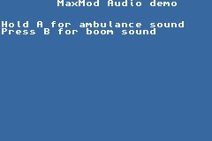
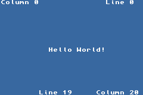
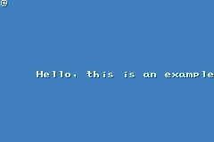

# gba-examples

Game Boy Advance examples using [libgba](https://github.com/devkitPro/libgba).

Authors: Christer Andersson, r6502, [WinterMute](https://github.com/WinterMute)

## Audio

`basic_sound.gba` plays a background music in a loop. Press and hold button A to play an ambulance sound on left speaker. Press button B to play a boom sound on right speaker.

`PlayBoyScout.gba` displays a static background image and plays a song repeatedly.

> BoyScout was a PC Windows softwaresynth that emulated the GameBoy Advance sound chip. It let you compose your songs in Windows through a tracker style interface with seamless transfer to GameBoy Advance.
[boyscout archive](http://web.archive.org/web/20170503190240/http://pidelipom.com/boyscout)

## Graphics

`ansi_console.gba` displays 'Hello World' at the center of the screen and 4 strings at each corner.

`PCXView.gba` displays a image PCX format with a fade-in effect (splash screen).

`SimpleBGScroll.gba`: displays a long scrolling text on the screen, from right to left.

## MBV2

`mbv2print.gba` sends a 'Hello World' using the [MultiBoot Version 2 (MBV2)](http://www.devrs.com/gba/files/mbv2faqs.php) cable.

## Template

`template.gba` prints a 'Hello World' at the center of the screen.

## Utility

`biosdumper_mb.gba` reads the Game Boy Advance BIOS and saves it to the SD/CF card using [libfat](https://github.com/devkitPro/libfat).

## Xboo

`XbooLoad_mb.gba` demonstrate the use of the Xboo Communicator file server and debug console. The example shows an image on screen. If button A is pressed, image fades out and reappears.

`XbooPrint_mb.gba` sends a 'Hello World' using the Xboo cable.